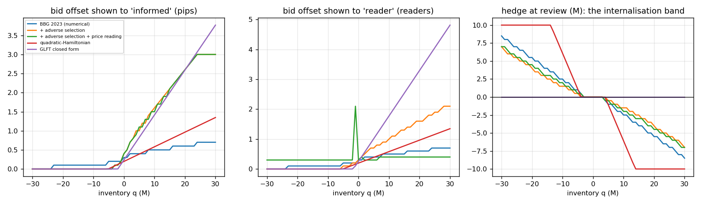
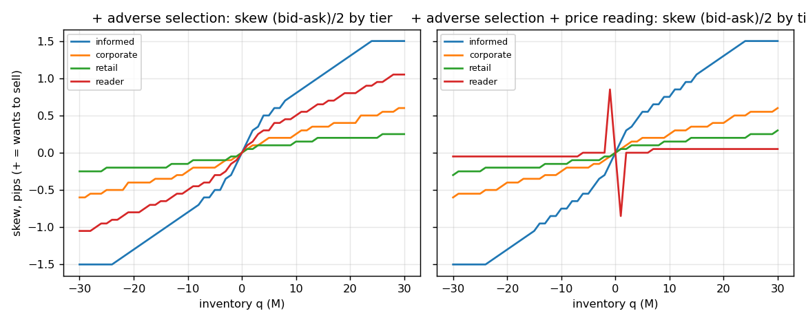
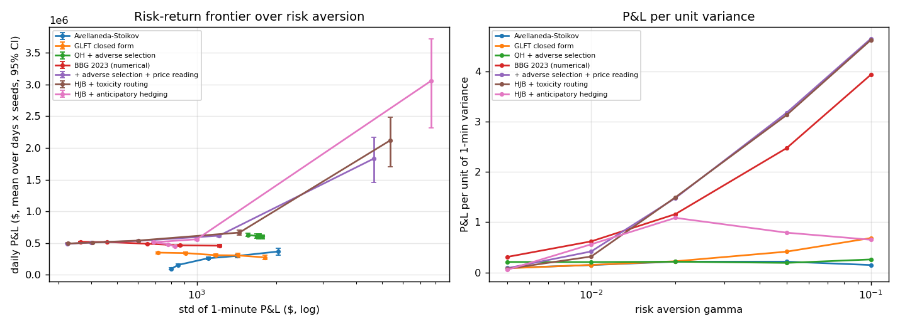
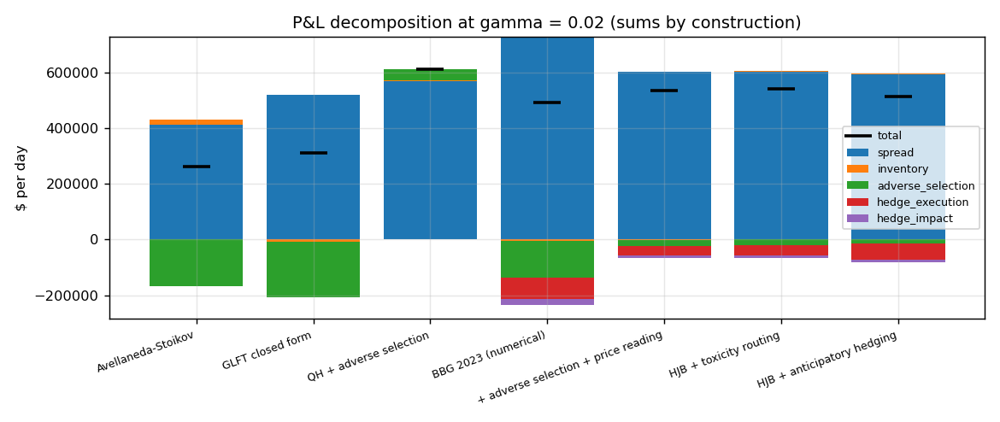
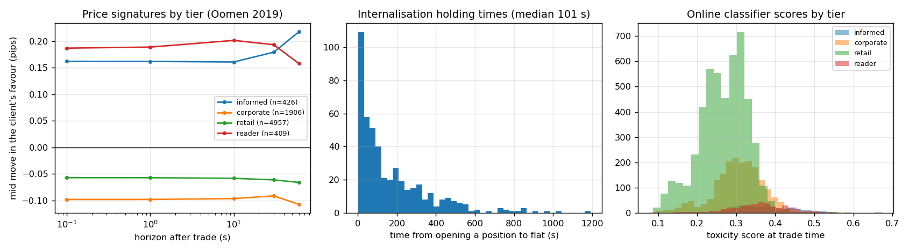
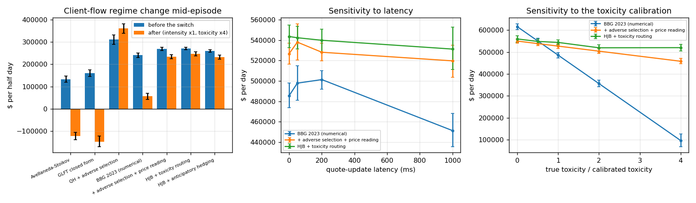
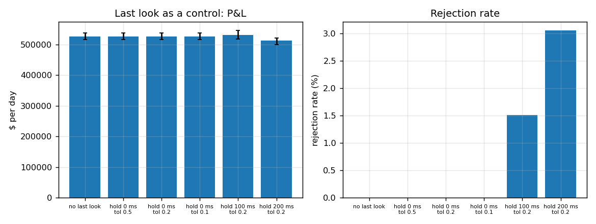

# fx-skew-internalisation — FX dealer skew, internalisation, adverse selection and price reading

**Question.** How should a dealer skew and hedge when some clients are informed, some read the dealer's skew, and hedging on the interbank venue has impact?

**Answer on four days of EURUSD (April 14–17, 2025; §Results).** Solving the dealer's problem with tier-specific adverse selection and skew-reading clients (the 2025 extension of Barzykin–Bergault–Guéant) rather than the 2023 base model widens the quotes shown to informed clients, steepens their skew, and *withdraws the skew from the readers entirely*: the reader tier is shown a ladder that is flat in inventory (skew slope 0.005 pips/M vs 0.05 without price reading) while every other tier keeps its skew. On the simulated client layer this cuts adverse-selection losses from −$130k to −$23k per day at γ = 0.02, raises P&L per unit of variance from 1.16 to 1.48 (+28 %, +18 % at γ = 0.1), and is the difference between surviving a mid-day toxicity shock ($269k → $233k per half-day) and not ($240k → $56k for the 2023 policy; Avellaneda–Stoikov and GLFT go negative). A mark-out-scored toxicity classifier feeding an internalise-or-externalise rule adds little in normal conditions (+1 %) and +6 % under the shock. Anticipatory hedging of autocorrelated flow does not pay at the calibrated autocorrelation. All of this is a calibrated simulation of the client layer around a real reference price; see *Data*.

Literature cut-off October 2025. Reuses Project A's book code (`include/fxmm/book.hpp`) as the interbank hedging venue and its mark-out tooling.

---

## Layout

| path | what |
|---|---|
| `tools/histdata.py`, `tools/dukascopy.py` | free EURUSD tick downloads (histdata.com monthly archives; Dukascopy hourly `.bi5`) → `data/ticks/EURUSD_<day>.csv` |
| `include/fxmm/ticks.hpp` | tick loader, σ / spread statistics |
| `include/fxmm/clients.hpp` | tiers, pricing ladder, logistic intensities, drifts, readers, autocorrelated flow direction |
| `include/fxmm/quoters.hpp` | Avellaneda–Stoikov, GLFT closed form, quadratic-Hamiltonian closed form (± adverse selection), numerical HJB (BBG 2023 + 2025 extension) |
| `include/fxmm/toxicity.hpp` | online Bayesian logistic (EKF) toxicity classifier on mark-out features |
| `include/fxmm/dealer.hpp` | event-driven simulator: hedging with impact, toxicity routing, anticipatory hedging, last look, latency, regime change, exact P&L decomposition |
| `src/main.cpp` → `fxmm` | CLI: `ticks`, `quotes`, `run`, `frontier`, `regime`, `sensitivity`, `lastlook` |
| `tests/tests.cpp` | 39 checks (P&L identity, no-skew symmetry, no-reader reduction, adverse widening, closed form vs numerical, classifier, last look, latency, loader) |
| `tools/mbt_gym_check.py` | Avellaneda–Stoikov quotes checked against mbt_gym's agent (Jerome et al. 2023) |
| `scripts/run_all.sh`, `plots.py`, `summarize.py`, `report.py` | pipeline, figures, `results/summary.md`, `report.pdf`; `notebooks/results.ipynb` |

Build: `./build.ps1` (MSVC + Ninja) or `cmake -S . -B build -G Ninja && cmake --build build`. Python: `numpy matplotlib requests fpdf2` (+ `gym` and a clone of mbt_gym in `third_party/` for the check).

---

## Data

| layer | source | what it gives |
|---|---|---|
| reference price | histdata.com EURUSD tick quotes, April 2025 (free; Dukascopy is the fallback and rate-limits bursts) | mid path, spread, volatility: 135k–184k ticks/day, median spread 0.60 pips, σ = 0.27–0.34 pips/√s; April 18 (Good Friday) excluded |
| client flow | simulated, calibrated to published moments | tier shares after the BIS Triennial Survey 2025 (turnover by counterparty type), spread sensitivities after the FX dealer papers, mark-out shapes after Oomen (2019) and the LMAX toxic-flow paper, holding times after Butz–Oomen (2019) |

Real single-dealer client flow and single-dealer-platform data do not exist publicly; every paper cited with real data uses proprietary bank or LMAX data. The empirical layer here is the reference price; the client layer is a calibrated simulation; the contribution is reproducing the 2021–25 closed forms and testing the policies on the risk–return frontier. The histdata spread (0.6 pips) is a retail feed's; the interbank hedging half-spread is set to ψ = 0.15 pips/M.

Calibration targets and what the simulation delivers (full model, γ = 0.02, one day): mean offsets paid 0.26 / 0.49 / 0.68 / 0.39 pips by informed / corporate / retail / reader tier; 10-second mark-outs +0.16 / −0.10 / −0.06 / +0.20 pips in the client's favour (informed and readers are toxic, the rest pay the spread); internalisation ratio 0.76; holding time median 101 s, mean 173 s — the "minutes" that Butz–Oomen report for EURUSD.

---

## Method

**Client layer.** A request from tier *i*, size *z*, side *s* arrives at intensity `Λ_{i,z}(δ) = λ_{i,z} f_i(δ)`, `f_i(δ) = 1 / (1 + exp(α_i + β_i δ))` on the offset δ (pips from mid) the dealer shows that tier and size — the logistic pricing ladder of the FX dealer papers. A trade moves the reference price by `μ_i z` pips in the client's direction over τ_i seconds (adverse selection as an Oomen price signature). Readers know the dealer's direction, read its magnitude from the skew shown to them, and trade more on the side that worsens the dealer's position and less on the side that would help it, by a factor `1 ± ρ |skew| / (s_ref Q)`. A hidden direction `m ∈ {−1, +1}` switching every ~10 min tilts everyone's buy probability to `½(1 + φ m)`, φ = 0.2 (autocorrelated flow).

**Dealer problem** (ergodic, running penalty `γ σ² q² / 2`, hedge cost `ψ|h| + η h²`, permanent impact κ per M):

```
ρ = max_{δ, h} [ −ψ|h| − η h² + κ h (q+h) − γ σ² (q+h)² Δt / 2
               + Σ_{i,z} Λ_{i,z}(δ^b) Δt [ z δ^b − μ_i z (q+h+z) + V(q+h+z) − V(q+h) ]
               + Σ_{i,z} Λ_{i,z}(δ^a) Δt [ z δ^a + μ_i z (q+h−z) + V(q+h−z) − V(q+h) ] ] + V(q)
```
solved by relative value iteration on a 0.5 M grid (Δt = 2 s, quotes on a 0.1-pip grid, readers' bid/ask chosen jointly because the shown skew feeds their intensity). Three nested versions: `HJB_2023` (no drifts, no readers: Barzykin–Bergault–Guéant 2023 with tiers, ladders, internalisation band and impact), `HJB_noread` (+ adverse selection), `HJB` (+ price reading). The internalisation band is the set of q where the optimal hedge is zero.

**Closed forms.** Avellaneda–Stoikov (naive baseline; matches mbt_gym's agent to 5e-10 pips), GLFT 2013 (`δ_b(q) = (1/γ) ln(1+γ/k) + (2q+1)/2 · sqrt(σ²γ/(2kA) (1+γ/k)^{1+k/γ})`, CARA, exponential intensity fitted per tier), and the quadratic-Hamiltonian approximation of the ergodic problem with adverse selection: with `θ(q) = −a q²/2` and `H_i(p) ≈ (A_i/k_i) e^{−1}(1 − k_i p + k_i² p²/2)`,

```
Σ_i z_i A_i k_i e^{−1} (a + μ_i)² = γ σ² / 2            (solve for a)
δ^{b/a}_{i,z}(q) = 1/k_i + (a + 2 μ_i) z / 2  ±  (a + μ_i) q
```
so adverse selection widens tier *i* uniformly by `μ_i z` and adds `μ_i` to its skew slope; the hedging band is `|q| < ψ / a`. Against the numerical HJB the closed-form slope is within a factor 2 (0.07 vs 0.12 pips/M in the single-tier test) — it is a benchmark, not the policy.

**Toxicity.** `P(toxic | x) = σ(w·x)`, `w ~ N(m, P)` updated by one extended-Kalman step per labelled trade (Cartea–Duran-Martin–Sánchez-Betancourt's Bayesian last layer); label = the client is ahead by more than 0.5 pips net of the spread paid after 30 s; features = tier, log size, shown skew signed by the client's direction, tier mark-out EWMA. `HJB_tox` externalises (hedges immediately) any trade scoring above 0.5 — the Cartea–Sánchez-Betancourt rule. `HJB_nwz` quotes and hedges on `q − ½·EWMA(signed flow)` (Nutz–Webster–Zhao: treat the forecast of autocorrelated flow as inventory). Last look: hold the request `h` ms, reject if the mid moved against the dealer by more than the tolerance (Oomen 2017; Cartea–Jaimungal–Walton 2019); the GFXC 2025 update sets zero additional hold time, which is the first row of the table.

**P&L decomposition** (exact, tested): `total = spread capture + inventory (q·dS_ticks) + adverse selection (q·dD_clients) + hedge execution (ψ|h| + η h²) + hedge impact (q·κ h)`.

---

## Results




Skew slopes (pips per M) informed / corporate / retail / reader: 2023 model 0.020 / 0.015 / 0.015 / 0.020; + adverse selection 0.080 / 0.025 / 0.015 / 0.050; + price reading 0.075 / 0.025 / 0.015 / **0.005**. Offsets at q = 0: 0.30 → 0.40 pips for the informed tier, unchanged elsewhere. Band: 3–4 M.




Frontier over γ ∈ {0.005, …, 0.1}, 4 days × 4 seeds per cell, 95 % bootstrap bands. Adverse-selection losses per day at γ = 0.02: AS −$167k, GLFT −$200k, 2023 model −$130k, full model −$23k. P&L per unit of 1-minute variance: full model 1.48 (γ = 0.02) and 4.65 (γ = 0.1) vs 1.16 and 3.94 for the 2023 model. `QH_adverse` never hedges (the Riccati root is a ≈ 0 for these drifts) and earns the most in expectation with 3× the variance — including a *positive* adverse-selection term: a long dealer skews its ask to informed buyers whose trades are followed by upward drift; at low risk aversion the numerical policy does the same (γ = 0.005 row), which is a real effect of the model, not an artefact.





Regime change (toxicity ×4 at mid-day): per half-day, AS $133k → −$121k, GLFT $160k → −$147k, 2023 model $241k → $56k, full model $269k → $233k, + toxicity routing $270k → $246k, + anticipatory hedging $260k → $232k. Latency: 1 s of quote staleness with fast tiers hitting mispriced quotes costs the 2023 policy 7 % and the full policy 1 % (its quotes to fast tiers are wider). Toxicity calibration: if true toxicity is 4× the calibrated value the 2023 policy keeps 20 % of its P&L, the full policy 87 %, the routed one 96 %. Last look with zero hold time rejects nothing at any tolerance (there is nothing to observe); 100–200 ms of hold rejects 1.5–3 % and changes P&L within noise.

## Validation

- **P&L decomposition sums by construction** (residual 1e-10 on every run; asserted in the tests for all quoters, with routing, last look and anticipation on).
- **No-skew case reproduces the symmetric quoter** (γ = 0: ladder symmetric and inventory-independent within one 0.1-pip grid step).
- **No-sniffer case reproduces the 2023 model** (ρ = 0 gives identical ladders and hedges to the machine precision).
- **Closed forms**: AS matches mbt_gym; GLFT symmetric at q = 0 with the right skew sign; QH slope within a factor 2 of the numerical HJB and the widening term equals `μ z`.
- **Sensitivity** to latency and to the toxicity calibration (tables above); **frontier bands** from 4 days × 4 seeds; **regime-change** test.
- `tests/tests.cpp`: 39/39; CI builds and runs a synthetic-price pipeline without data.

## Limitations, stated

The client layer is simulated; its parameters are calibration targets, not measurements, and every dollar figure scales with them. Adverse selection is modelled as a deterministic post-trade drift, price reading as a multiplicative intensity effect with readers who know the dealer's direction; both are one plausible reading of the 2025 paper, which is reproduced in mechanism (uniform widening, tier-specific skew withdrawal) rather than in its exact equations. The quadratic-Hamiltonian closed form degenerates (a → 0, no hedging) when informed drifts are large relative to risk; the numerical HJB is the policy. Multi-currency inventory, the RL quoter and a full last-look conduct analysis are not done (stretch items).

**CV bullet as supported by the data.** Dealer market-making simulator (C++ book, Python research) extending Barzykin–Bergault–Guéant (2023) with adverse selection and price reading (2025): the extended policy withdraws skew from skew-reading clients, cuts adverse-selection losses by 82 % and raises P&L per unit variance by 28 % over the base model on four days of EURUSD with a calibrated client layer; a mark-out-scored toxicity classifier driving internalise-or-hedge adds +1 % normally and +6 % under a toxicity shock; RL quoter not done.

## References

Barzykin, Bergault, Guéant, *Algorithmic market making in dealer markets with hedging and market impact*, Math. Finance 2023 (arXiv:2106.06974) · *Market making by an FX dealer: tiers, pricing ladders and hedging rates* (arXiv:2112.02269) · Barzykin, Bergault, Guéant, Lemmel, *Optimal quoting under adverse selection and price reading* (arXiv:2508.20225) · Guéant, Lehalle, Fernandez-Tapia, *Dealing with the inventory risk*, Math. Fin. Econ. 2013 · Avellaneda, Stoikov, *High-frequency trading in a limit order book*, QF 2008 · Jerome, Sánchez-Betancourt, Savani, Herdegen, *mbt_gym*, ICAIF 2023 · Oomen, *Price signatures*, QF 2019 · Cartea, Duran-Martin, Sánchez-Betancourt, *Detecting toxic flow* (arXiv:2312.05827) · Cartea, Sánchez-Betancourt, *A simple strategy to deal with toxic flow* (arXiv:2503.18005) · Nutz, Webster, Zhao, Math. Finance 2025 · Butz, Oomen, *Internalisation by electronic FX spot dealers*, QF 2019 · Oomen, *Last look*, QF 2017 · Cartea, Jaimungal, Walton, *Foreign exchange markets with last look*, Math. Fin. Econ. 2019 · BIS Triennial Central Bank Survey 2025 (preliminary) · GFXC FX Global Code, 2025 update.
